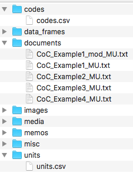
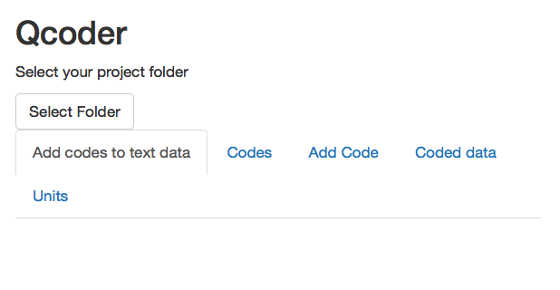
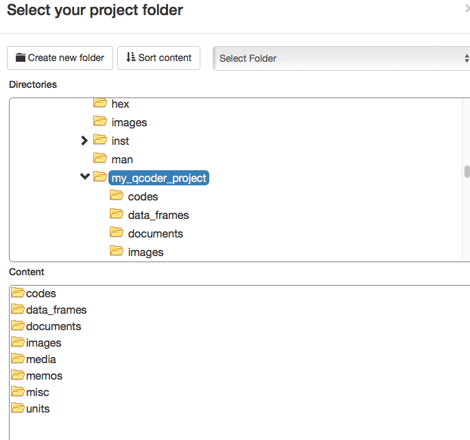
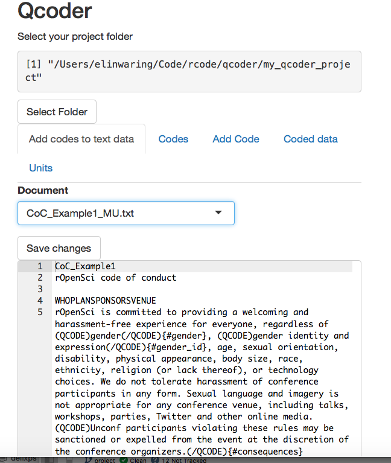

<!-- README.md is generated from README.Rmd. Please edit that file -->
QCoder
======

Lightweight package to conduct qualitative coding  

Installation
------------

To install the latest development version, run

    install.packages("devtools")
    devtools::install_github("ropenscilabs/qcoder")

Please note that this is not a release-ready version and should be
considered experimental and subject to changes. Still, we encourage you
to install and send us feedback on our issue tracker.

For instructions for use, see the **Using QCoder** section below.

Motivation
----------

The motivation stems from the need for a free, open source option for
analyzing textual qualitative data. Textual qualitative data refers to
text from interview transcripts, observation notes, memos, jottings and
primary source/archival documents. A detailed discussion of the
motivation and other software can be found in our (motivation
document)\[motivation.rmd\].

Using QCoder
------------

QCoder is designed to be easy to use and to require minimal knowledge of
computer systems and code. Like all software, including other
applications for QDA there will be a learning period, but as we develop
Qcoder our goal will be to keep the interface simple and steadily
improve it. Currently we have a very minimal prototype.

Once you have installed QCoder, load it with the library command.

    library(qcoder)

This readme file is going to use sample data to illustrate basic QCoder
functionality. We will be using the simplest approach which is to use
the QCoder defaults for file names and folders. If you follow those same
patterns and conventions with your data you can use QCoder in the same
way. A full vignette will explain how to use non standard names and file
locations.

To begin we will create a QCoder project with sample data. (To create an
empty project leave out the sample option.)

    create_qcoder_project("my_qcoder_project", sample = TRUE)

This will create one main folder and four subfolders. Unless you
specified otherwise it will be in your current working directory (you
can find this with the `getwd()` command at the console). If you have a
specific location where you want to put the folder change your working
directory.

These will hold the documents to be coded, information about the codes,
unit information and the r data frames that will be the core of the
analysis. For this example the folder and file structures for the sample
data will look similar to this.

### Documents

In our example we've already placed our documents into the "documents"
folder. At this point we only have tested support for txt files though
other types will probably work. If you have documents in other formats
you can use "Save As" to convert to txt.

### Codes

QCoder has the option to import a list of predefined codes from a CSV
file (if you have this in a spreadsheet you can "Save As" csv). This
file should have exactly 3 columns with headings:

-   code\_id (A unique number for each code)
-   code (One word description, can use underscores or hyphens)
-   code.description (Longer description of the code, must be enclosed
    in quotation marks.)

To use project defaults, this file should be called *codes.csv*. Here
are the contents of the sample data csv file that comes with QCoder.

     code_id,code,code.description
    1,"harassment","define or describes harassing behavior"
    2,"person_talk","naming a specific person to talk to if there are violations"
    3,"gender","mentions gender"
    4,"gender_id","mentions gender identity or expression"
    5,"consequences","Detailing what happens if someone violates the code of conduct"
    6,"license","The license for this code of conduct"

You are not restricted to using the listed codes in the csv file, but
this file allows you to produce a detailed codebook including
descriptions. (A method for adding new codes is high priority item on
the project road map.)

### Units

Units represent the unit of analysis data are about. Often this is
individual people, but it may also be organizations, events or
locations. Units may be associated with multiple documents. In the
sample data a minimum units file is used, but additional columns can be
used to assign attribute data.

The default file name is units.csv; if stored in a spreadsheet this can
be creatd by using "Save As" csv.

(Treatment of units is a work in progress and subject to change.)

    Filename,unit_id,Name
    CoC_Example1.txt,1,"rOpenSci"
    CoC_Example2.txt,2,"LIBD Rstats Club"
    CoC_Example3.txt,3,"Carpentries"
    CoC_Example4.txt,4,"Rladies

### Importing the data

To import this data into Qcode user the `import_project_data()`
function.

    import_project_data(project = "my_qcoder_project")

Now the data\_frames folder will contain the imported files.

Now it's time to start coding.

Coding uses a "Shiny App" to provide a user interface to the data. To
launch the app use the function `qcode_edit()`.

    qcode()

Which will launch this application.

Coding
------

Put the full paths to your documents and codes data frames in the
corresponding fields. To get these you may need to use the file explorer
on your computer. Make sure to include the .rds at the end of paths.

Once you have entered the paths there will be a drop down menu on the
"Add codes to text" tab to allow you to pick a specific document to
code. This will pull a document into the editor.

Select your project folder.

Once you have a project, use the drop down menu to select a particular
document to code. This will open in an editor. When done coding
(instructions below), click Save changes.

Select your project folder.

Switching to the "Codes" tab a list of codes from the codes file is
displayed.

Our sample data already has some coding done, and the code-text data is
displayed on the "Coded data" tab.

### Coding the data

To add codes to the documents uses a tagging system. Text to be assigned
a code should be surrounded by (QCODER) (/QCODER) tags. The closing tag
is followed immediately by the code enclosed in curly brackets and
prefixed with a \# for example {\#samplecode}

(QCODE)This is the text that is being assigned a
code.(/QCODE){\#instructions}

One pair of {} can contain multiple codes, each with at \# and separated
by commas.

When you have finished coding a document press the "Save changes"
button.

Contributors
------------

-   [Elin Waring](https://github.com/elinw)
-   [Dan Sholler](https://github.com/dsholler)
-   [Jenny Draper](https://github.com/learithe)
-   [Beth Duckles](https://github.com/bduckles)
